# みんなで使う考古学データ

### 当日発表スライド

[https://ishiijunpei.github.io/Foss4G2019/](https://ishiijunpei.github.io/Foss4G2019/)

## お話したいこと
 

- 考古学情報化プロセスの現状
- デジタル化する情報取得とアナログ前提の**ワークフロー**
- 考古学情報の**真正性**と再現可能性
- **非専門家**による考古学情報へのアクセス

---
## トータルステーションで遺構計測

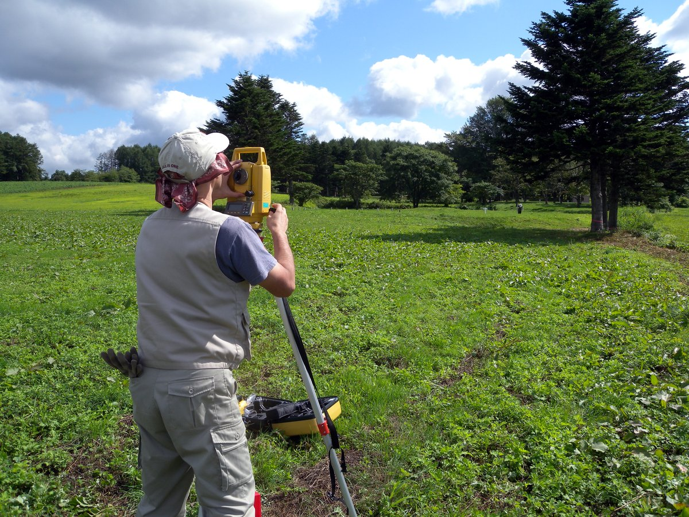

---
## sfM/mvsによる計測

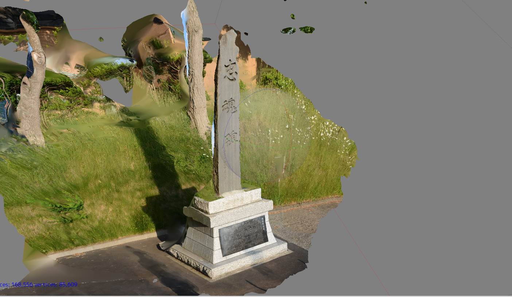

---
## 遺物計測の新視点

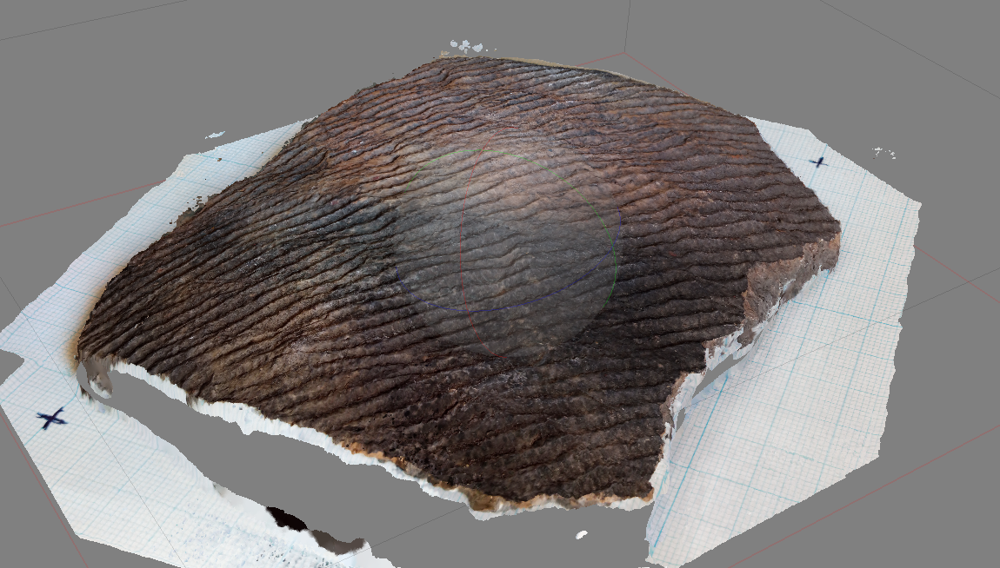

---
## 「縄文」CS立体図

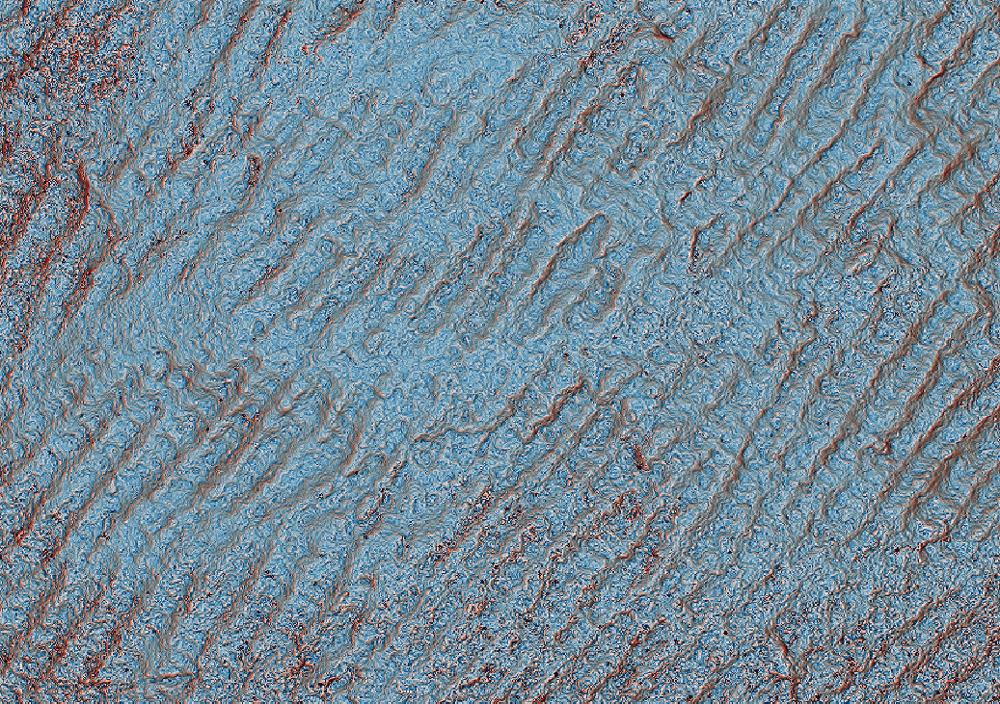

---
## アナログ化する考古学情報
 

今や、考古学情報の多くは

デジタルデータとして取得されている。

だがしかし、

いつのまにかアナログ化してしまう・・・

---

トータルステーションでデータ取得

.csv or .dxf　→　イラストソフトへ

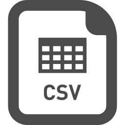

---

- 数百万の費用をかけて設置した基準杭
- 数百万の費用をかけてリースした測量器材

 

なぜあっさりと

### **位置情報**を捨ててしまうのか

---
## 紙媒体が**成果品**
 

技術が変わったのに**ワークフロー**を変えられない。

発掘調査報告書が完成すれば仕事は完了

---
## 文化庁の立場
 

「（印刷物は）刊行後の**改変が困難**であるため,情報の**真正性**が確保できる」（文化庁2017『埋蔵文化財保護行政におけるデジタル技術の導入について 2 』 ( 報告 ),p12）

---
文化庁の情報に対する考え方の前提は

 

## 凍結保存

 
情報流通や機械可読性は二の次

---
**凍結保存**によって
 

## 考古学情報の**再現可能性**を封殺
 

情報の再現可能性は、

情報の「**真正性**」と密接にかかわる

---
## 考古学情報処理セッション
 

2019年5月18日於駒沢大学

日本考古学協会

セッション7「考古学・埋蔵文化財における

情報処理のワークフローと実践」

---

- デジタル化された記録の**シームレス**な受け渡し
- **伝統的**なワークフローによる不適切な情報処理
- 考古学情報への**アクセシビリティ**
- 考古学情報作成における「**ブラックボックス化**」

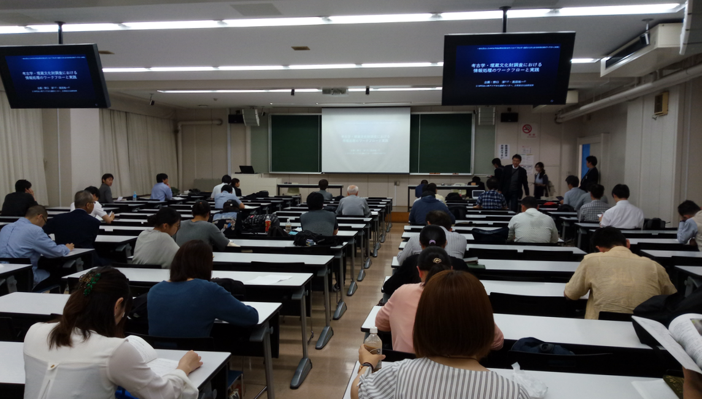

---

<iframe src="https://www.slideshare.net/slideshow/embed_code/key/bdOsn6QGILYbPA" width="595" height="485" frameborder="0" marginwidth="0" marginheight="0" scrolling="no" style="border:1px solid #CCC; border-width:1px; margin-bottom:5px; max-width: 100%;" allowfullscreen> </iframe> 
 <strong> <a href="//www.slideshare.net/atsushinoguchi/jaa2019session7archaeoinfomaticsoutline" title="JAA2019_Session7_Archaeoinfomatics_outline" target="_blank">JAA2019_Session7_Archaeoinfomatics_outline</a> </strong> from <strong><a href="https://www.slideshare.net/atsushinoguchi" target="_blank">NOGUCHI Atsushi</a></strong> 

---

<iframe src="https://www.slideshare.net/slideshow/embed_code/key/Ci4Yvgah5UBFW" width="595" height="485" frameborder="0" marginwidth="0" marginheight="0" scrolling="no" style="border:1px solid #CCC; border-width:1px; margin-bottom:5px; max-width: 100%;" allowfullscreen> </iframe> 
 <strong> <a href="//www.slideshare.net/tsknmymt/ss-146617554" title="埋蔵文化財行政におけるデジタル情報の活用ー九州・熊本における取組み事例ー" target="_blank">埋蔵文化財行政におけるデジタル情報の活用ー九州・熊本における取組み事例ー</a> </strong> from <strong><a href="https://www.slideshare.net/tsknmymt" target="_blank">利邦 宮本</a></strong> 

---

<iframe src="https://www.slideshare.net/slideshow/embed_code/key/K9uqhZrNXVnUwJ" width="595" height="485" frameborder="0" marginwidth="0" marginheight="0" scrolling="no" style="border:1px solid #CCC; border-width:1px; margin-bottom:5px; max-width: 100%;" allowfullscreen> </iframe> 
 <strong> <a href="//www.slideshare.net/YuichiTakata/ss-147057578" title="デジタル技術を活用した発掘調査報告書のアクセス性向上の試行" target="_blank">デジタル技術を活用した発掘調査報告書のアクセス性向上の試行</a> </strong> from <strong><a href="https://www.slideshare.net/YuichiTakata" target="_blank">Yuichi Takata</a></strong> 

---
## 全国遺跡報告総覧の衝撃

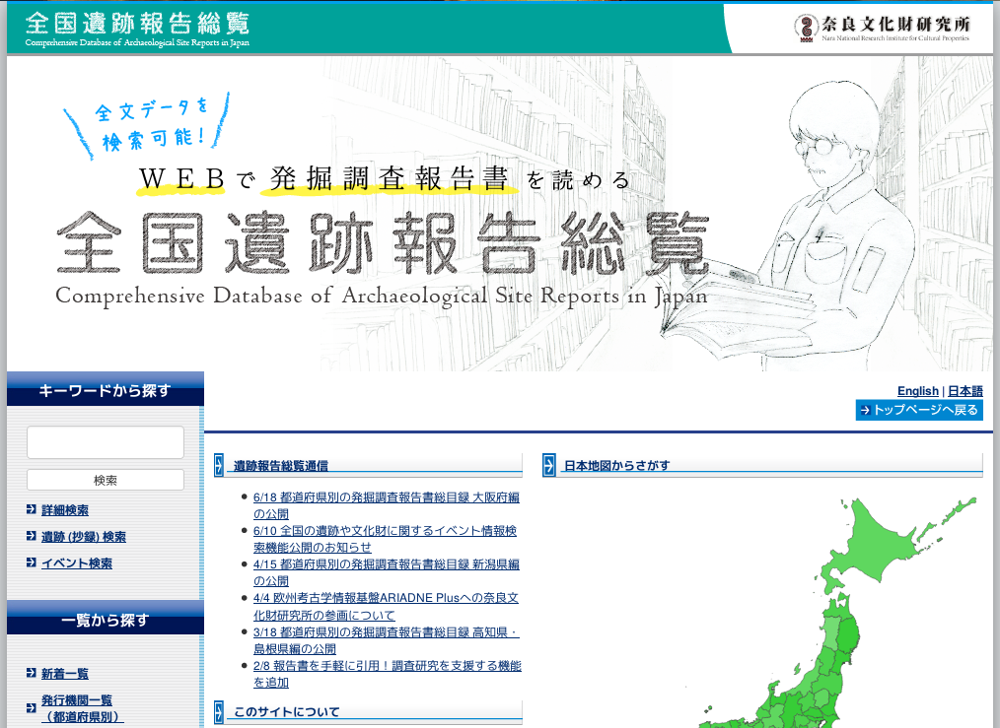

---
## 全国遺跡報告総覧
 

登録報告書23,454件

書誌登録数61,758件

遺跡抄録件数125,909件

年間ダウンロード件数1,410,000件

アクセス数11,170,000件

ページ閲覧数100,000,000件

---
## 多量の情報に対応する技術
 

全文テキスト検索＝**18億**文字

ここで検索して「ない」情報は

「考古学とは無関係」と言い切れるかもね

---
「オープンソース」で検索

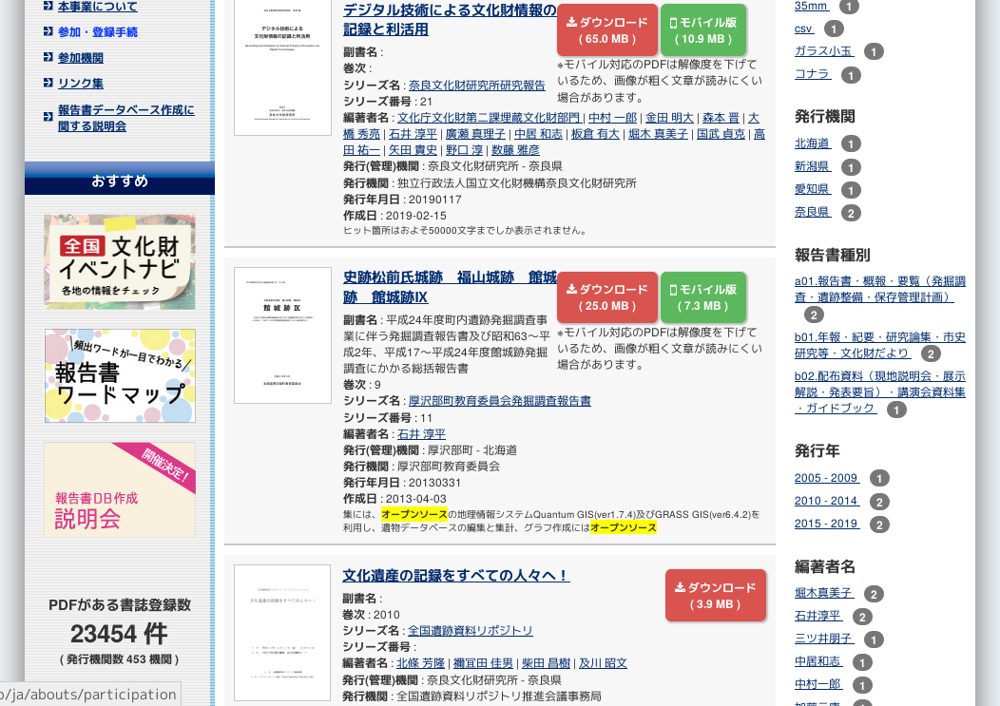

---
用語が分かれば検索できる

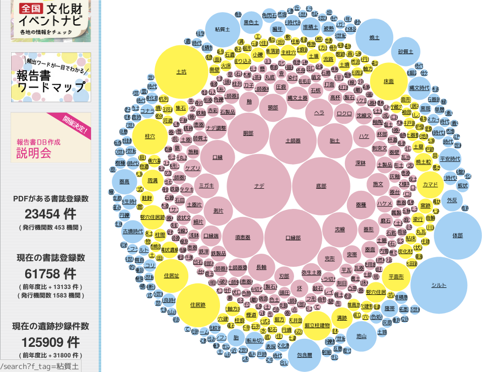

---
## 考古学情報の流通
 

- 調査記録の公正性を確保しつつ
- チームの作業重複をふせぎ
- 原データや中間生成物も公開

---
## 二股台場調査でのGit利用
 
- 遠隔地で整理作業
- 複数人で調査記録の編集

 
調査記録の**公正性**の確保と**作業重複**の回避

---
## GitKraken

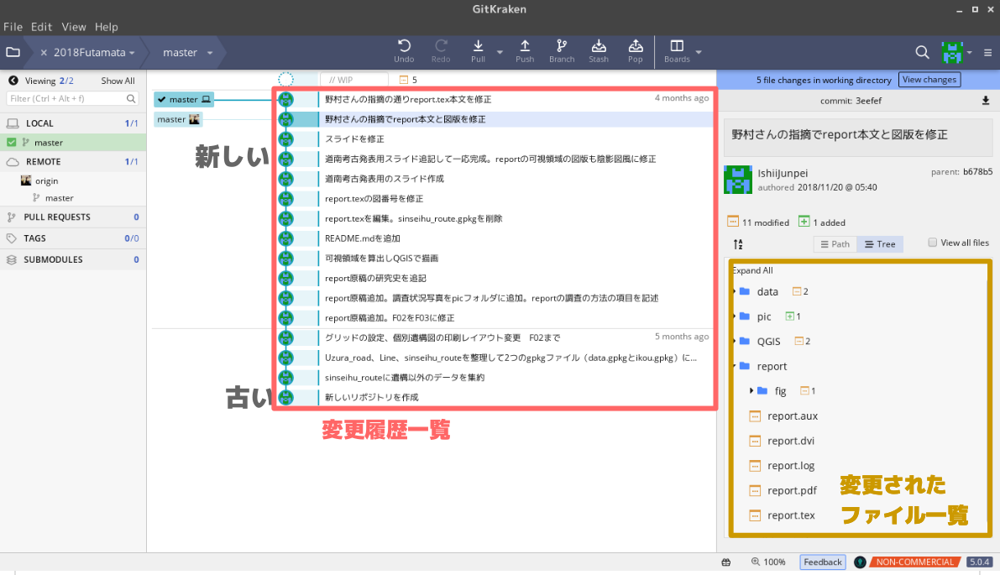

---
## GitHubで履歴とともに公開

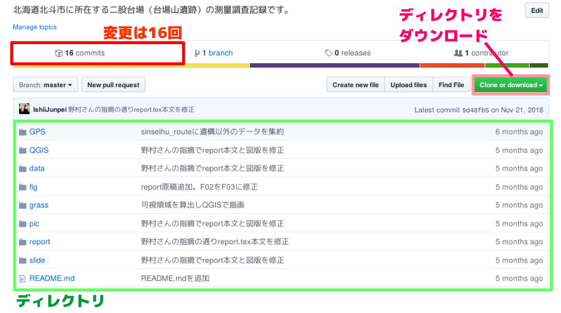

---
GitHub報告書でいいんじゃないかと・・・

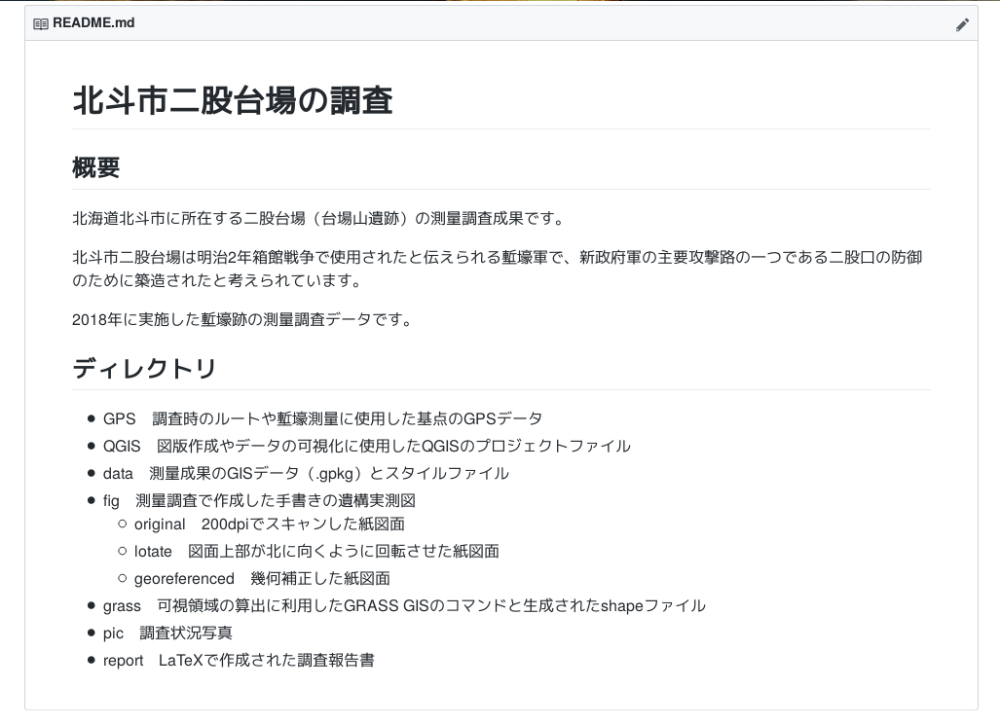

---
## 考古学への**参入障壁**を下げる

 

- 考古学への**非専門家**の関与
- 考古学情報の**真正性**の担保
- 考古学データの**再利用** 

---
### 考古学の課題は**現代**の課題

 

- 土地と人のかかわりの**履歴**
- 地域のアイデンティティと**ブランディング**
- 「この場所はこんな場所」という**ラベリング**
- 「こうあるべき」という**意思決定**

---
考古学は

### **社会全体**に関わる情報

 

- 非専門家（**市民**）による考古学情報へのアクセス
- 考古学的**意思決定**への関与

 

手続きへの道筋が開かれていることが重要

 

### 考古学の**民主化**

---
DEMデータの分析なら、

考古学者より得意な人はいますよね？

---
## 遺物分布は空間クラスタリング

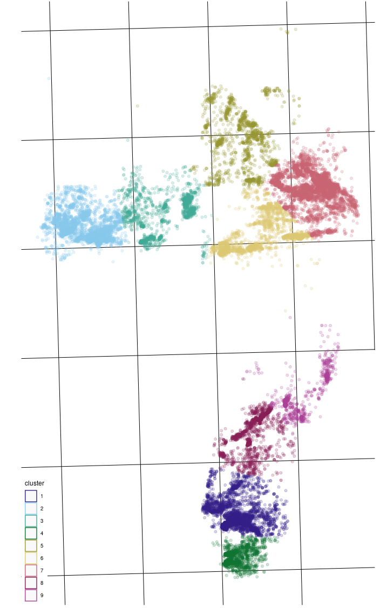

---
## オープンデータとしての考古学情報

 

- 調査の原記録
- 中間成果物

 
すべてのデータにアクセスできる環境の構築

---
## 脱独占

非専門家による資料操作と解釈

 

- **データ取得**
- 資料操作
- 資料解釈
- **報告書出版**
- 論文執筆
- 概説書出版

---
## 考古記録の自由な利用
 

- 生のデータの利用
- 考古学のフィルターのかからないデータ

---
## オープンな記録
QGIS+.gpkgでよろしいかと思います

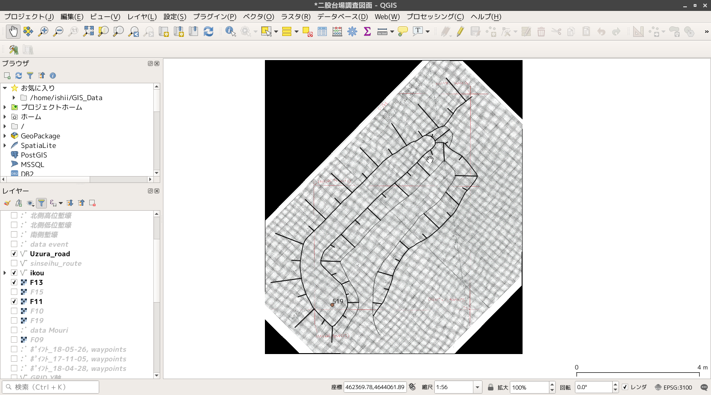

---
## Free Open へのこだわり

 

情報公開戦略としてのOSS

オープンな**データ**と

オープンな**ツール**の組み合わせ

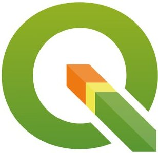

---
データをつくる人が

データを使えない

 
役場職員の本音

### 「毎日毎日僕らは調査もの・・・」

---
### データを扱う**ツール**
 

### データを扱う**スキル**

---

## ツール+スキル　=　FOSS4G

 
--------

### ご清聴ありがとうございました。

